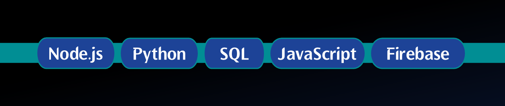

Greetings,

I'm Vasipalli Eshan Aditya (alias: eshangonemad). I'm an avid programmer who likes to challenge constraints and find unique solutions to problems in society. I previously worked with languages and tools such as Node.js, firebase, python, SQL, and more. I've participated and won several hackathons at school and internationally.

I hope you stumble across my profile once again...

 
